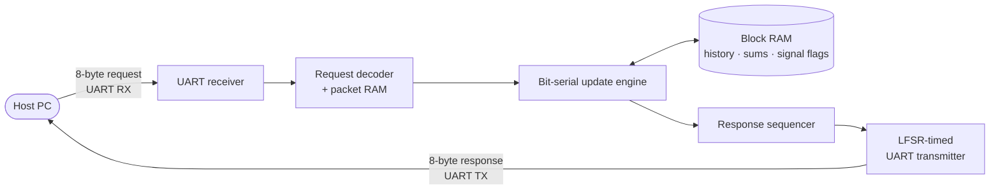

# A 195-LUT Trading-Signal Engine on an FPGA

**Gator Quant Hacks 2026 · Hardware Track** — built in one weekend at the University of Florida.

[](https://github.com/janestreet/hardcaml)
[](https://wiki.sipeed.com/hardware/en/tang/tang-nano-20k/nano-20k.html)
[](submission/BOARD_VALIDATION.md)
[](serial_adder_approach/evidence/serial_lfsr/)

A Tang Nano 20K FPGA takes live price updates for two instruments over UART.
For each one, it tracks a 16-sample moving average and replies with
**BUY / SELL / NONE** whenever the price crosses its average. Parsing, history,
arithmetic, signal state and the response all run in hardware. No host-side
computation is involved.

The design is written in **[Hardcaml](https://github.com/janestreet/hardcaml)**,
Jane Street's OCaml library for describing hardware, and is compiled to Verilog
for Gowin's FPGA toolchain. Once the design was correct on the board, the
objective was to make it **as small as possible**. It went from about 420 logic
cells to **195**.

## Results

| | Final design |
| --- | ---: |
| **Logic cells (post place-and-route)** | **195** (193 LUTs at synthesis) |
| Registers | 98 |
| Block RAMs | 4 |
| Arithmetic (ALU) cells | 0 |
| Clock | 27 MHz on-board oscillator (no PLL) |
| Timing | 0 setup / 0 hold violations, +29.2 ns worst slack |
| Official practice tests on the board | **10/10 runs, 84/84 scored packets each, 0 timeouts** |
| Custom replay on the board | **2,834 / 2,834 packets** across 26 sessions |
| Mean round trip, host → FPGA → host | **16.8 ms** (full latency points at ≤ 20.8 ms) |

The FPGA itself spends about 55 clock cycles (≈ 2 µs) on each packet, and
putting 16 bytes on the wire at 115200 baud takes about 1.4 ms. Nearly all of
the remaining round-trip time is spent outside the chip, in the on-board
USB-serial bridge and the host.

Sources: [Gowin resource and timing reports](serial_adder_approach/evidence/serial_lfsr/),
[board validation record](submission/BOARD_VALIDATION.md),
[simulation log](serial_adder_approach/evidence/verification.log).

## The challenge

The organizers fixed the protocol and grading. The FPGA receives an 8-byte
request and must answer with exactly one 8-byte response:

```text
PC -> FPGA: [index:16][item A:8][price A:16][item B:8][price B:16]
FPGA -> PC: [index:16][item A:8][action A:8][item B:8][action B:8][reserved:16]

items:   A = 0x11, B = 0x22        actions: NONE = 0x00, SELL = 0x01, BUY = 0x02
UART:    115200 baud, 8N1, LSB first; multi-byte fields big-endian
```

Each item keeps its own 16-price window. Index 0 starts a new session, and
indices 0–15 only fill the window (they return NONE). From index 16 on:

```text
BUY   if the previous price was at or below the old average
         and the current price is above the new average
SELL  if the previous price was at or above the old average
         and the current price is below the new average
else  repeat the last action
```

Averages are `sum >> 4`, rounded down. Judging was a 100-packet run, scored
as **correctness 70 + latency 15 + logic size 15**, followed by a hidden
full-range run with prices from 0 to 65535. Below 95% correctness, the
latency and size points are zero. Among qualifying teams, ranking was by total
logic first, then registers, then latency.

## How it works



Most of the savings came from moving work from logic into **time** and
**memory**. The protocol leaves plenty of both, and block RAM does not count
toward the logic total. One UART byte takes 2,340 clock
cycles, so the design can afford to be slow internally.

- **Bit-serial arithmetic.** Each item keeps an exact 20-bit running sum. A
  normal design updates it with 20-bit adders. This one uses a single-bit full
  adder and a single-bit subtractor, which compute `sum + new − oldest` one bit
  per clock over 20 cycles. That removed every ALU cell.
- **State lives in block RAM, not flip-flops.** Price history (512×1), running
  sums (64×1), signal flags (2×4) and packet bytes (8×8) sit in four inferred
  BSRAMs. Nothing is ever cleared. Per-item *valid* bits mask stale contents
  after a reset or a new session.
- **No divider, no second comparator.** A four-clock delay lines up price bits
  with sum bits 4–19, so the comparison against `sum >> 4` happens serially as
  the sum streams past. Each item stores two flags, *was below* and *was above*,
  instead of the full previous price.
- **A smaller transmitter.** The UART TX is a ten-bit `{stop, data, start}`
  shift register driven by LFSR counters instead of binary counters. That saved
  another 8 cells.
- **Nothing extra.** There is one 27 MHz clock domain, no PLL, and both LEDs
  are held off.

Design notes and memory layouts are in
[`serial_adder_approach/README.md`](serial_adder_approach/README.md).

## Optimization path

| Milestone | Logic | Registers | Block RAM |
| --- | ---: | ---: | ---: |
| First end-to-end build working on the board | ~420 | — | — |
| First optimization passes (H1–H4) | 363 | 235 | 1 |
| History and packet storage moved into block RAM, registers trimmed | 302 | 109 | 3 |
| Lean variant: heartbeat and fault LEDs removed | 270 | 84 | 3 |
| Bit-serial update engine | 203 | 97 | 4 |
| **+ LFSR-timed UART transmitter (final)** | **195** | **98** | **4** |

The intermediate candidates and their Gowin reports are kept under
[`gowin/`](gowin/). The full history is in
[`docs/development/`](docs/development/README_DEVELOPMENT.md).

## Verification

The test suite never trusts the design to check itself.

- **Independent oracle.** A separate Python model computes every expected
  window, sum and action directly ([`test/engine/oracle/`](test/engine/oracle/)).
- **Hardcaml-level tests.** Cyclesim, expect and property tests cover the
  UART, the protocol decoder, the packet RAM and the transaction controller
  ([`test/`](test/)).
- **Generated Verilog against the oracle**, simulated in Icarus Verilog and
  checked structurally with Yosys. The engine test checks **8,956 samples**,
  including stored sums and flags, deliberately corrupted RAM contents, and
  stalls. The transmitter test checks **all 256 byte values**, verifying that
  every bit lasts exactly 234 clocks. The full design replays **1,394 oracle
  packets** at the real baud divisor. It also covers startup, pauses between
  bytes, framing faults, and reset recovery in the receiver, engine and
  transmitter.
- **On the board.** The organizers' quick and robust test scripts ran five
  normal and five full-range price runs back to back, with no reset in between.
  Then a custom replay-and-measure runner ([`test/runner/`](test/runner/))
  played 2,834 packets, covering extreme prices, slot swaps, window wraparound
  and sessions that restart mid-warm-up.
- **Market-data traffic.** A Databento trade streamer ([`lib/`](lib/), [`bin/stream.ml`](bin/stream.ml))
  and a Python fixture factory ([`tools/test_data_factory/`](tools/test_data_factory/))
  generate request streams for testing.

```sh
# Full regression suite (needs the OCaml 5.2.0+ox switch, iverilog, yosys, python3)
opam exec --switch=5.2.0+ox -- dune runtest
```

## Build and run it

**Rebuild the FPGA image.** You only need Gowin EDA V1.9.11.03 Education. The
committed Verilog is self-contained.

```sh
gw_sh submission/gowin/build.tcl     # outputs to submission/gowin/impl/
```

**Program the board.** In Gowin Programmer, select **GW2AR-18C**, choose
**SRAM Program**, and load [`bitstream/gqh_serial.fs`](bitstream/gqh_serial.fs).

**Validate it on the board** (Python 3 + pyserial):

```sh
python3 serial_adder_approach/validate_board.py <PORT> --fs bitstream/gqh_serial.fs
```

**Regenerate the Verilog from Hardcaml** (optional):

```sh
opam exec --switch=5.2.0+ox -- dune exec serial_adder_approach/generate.exe
python3 serial_adder_approach/verify.py
```

The HDL toolchain uses OCaml **5.2.0+ox** and the pinned Jane Street
`v0.18~preview` packages listed in [`dune-project`](dune-project). Exact build
inputs and hashes are recorded in [`submission/manifest.json`](submission/manifest.json),
and a clean-location rebuild is documented in [`submission/REBUILD.md`](submission/REBUILD.md).

| Pin | Port | Use |
| ---: | --- | --- |
| 4 | `sys_clk` | 27 MHz oscillator |
| 87 | `reset_btn` | Reset button (active high) |
| 70 | `uart_rx_i` | BL616 → FPGA |
| 69 | `uart_tx_o` | FPGA → BL616 |
| 15, 16 | `led0_n`, `led1_n` | Held off |

## Repository layout

| Path | What's there |
| --- | --- |
| [`serial_adder_approach/`](serial_adder_approach/) | **Final design**: bit-serial engine and transmitter (Hardcaml), generated Verilog, build, verify and board-validation scripts, evidence |
| [`src/`](src/) | Shared Hardcaml library: UART RX/TX, protocol decoder, packet RAM controller, response sequencer, board tops |
| [`bitstream/`](bitstream/) | Programming images; `gqh_serial.fs` is the submitted one |
| [`submission/`](submission/) | Reproducible Gowin build script, input manifest, board-validation record |
| [`test/`](test/) | Cyclesim, expect and property tests; Verilog testbenches; independent oracle; replay runner |
| [`tools/`](tools/) | Organizer test scripts, Gowin automation, test-data factory |
| [`lib/`](lib/), [`bin/`](bin/) | Databento streamer and Verilog generator CLI |
| [`rtl/`](rtl/), [`gowin/`](gowin/) | Earlier candidate designs and their Gowin projects and reports |
| [`docs/`](docs/) | Optimization write-ups, the event guide, development plans |
| [`archive/`](archive/) | Original project proposal and board bring-up projects |

## Known limitations

- The protocol is stop-and-wait. A UART framing error, or input arriving while
  a response is still being sent, locks the protocol until the reset button is
  pressed.
- The saved board summary covers every stage through the post-reset custom
  replay. The final fault-recovery stages were confirmed by the operator and are
  not in the machine log. See [the validation record](submission/BOARD_VALIDATION.md).
- Gowin reports warning PR1014 about clock routing. The timing report shows no
  setup or hold violations.

## Team

Built by **[@LeEmperor](https://github.com/LeEmperor)**, **[@shome9806](https://github.com/shome9806)**, **[@srijankumbam](https://github.com/srijankumbam)**, and **[@vishal-naveen](https://github.com/vishal-naveen)**.

## Acknowledgements

- **[Jane Street Hardcaml](https://github.com/janestreet/hardcaml)** and the
  surrounding OCaml libraries are the foundation of the design.
- **The Gator Quant Hacks organizers** provided the [participant guide](docs/gqh_hw_guide.pdf),
  the board constraints, and the official test scripts ([`tools/official/`](tools/official/)).
- Gowin EDA, Icarus Verilog and Yosys were used for synthesis, simulation and
  structural checks.
